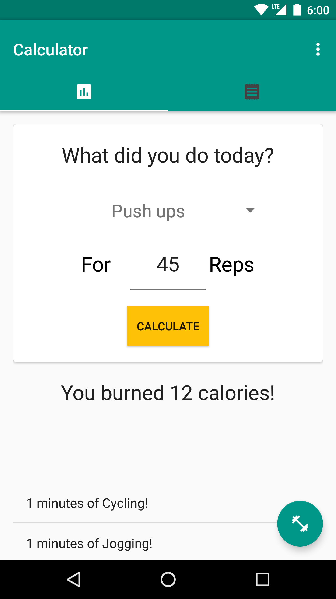

# PROG 01: Crunch Time

Calorie Receipt is a calorie conversion and documenting app. Calorie receipt offers
a simple and intuitive design to determine how many calories different activities burn,
what it takes to burn the same amount of calories with different activities, as well as
track groups of past activities with calorie totals.

Calorie receipt uses the Material Design guideline crafted by Google in order to
provide a visually pleasing interface that blends in with the system applications
on Android devices.

## Authors

Kyle Hotchkiss ([khotchkiss13@berkeley.edu](mailto:khotchkiss13@berkeley.edu))

## Demo Video

See [Prog 01 Demonstration] (https://youtu.be/aZIhvdJ5BGc)

## Screenshots: Base Features

Landing page when app is first opened:

Spinner options:

Burn Calories selected:

Activity measured in minutes selected:

Activity measured in reps selected:

Filling out the form:

First view after clicking "CALCULATE":

Scroll down to hide input form:

Scroll to bottom of list:

## Screenshots: Extra Feature: Toggle activities

Default Activity Settings page:

Deactivating settings:

Results in shortened spinner list:

## Screenshots: Extra Feature: Change Orientation

Orientation on Tab 1:

Orientation on Tab 2:

## Screenshots: Extra Feature: Keep track of activities

Empty activity collection (Receipt) screen:

New Receipt form appears on FAB press:

Same form appears on either tab:

Filling out receipt form:

Receipt saved:

View of all items in a receipt:

## Acknowledgments

* I would like to thank Google for providing very detailed guidelines to
produce great looking application. I would also like to thank them for their
icon set, which I use throughout the app.
* I would especially like to thank Stack Overflow for being my guide throughout the
entire development process. I don't think I could do this without their service.
* Thank you to the GSI's for helping us get started with Android and UI design.
* Lastly, I would like to thank YouTube for allowing developers to post tutorial
videos on Android development, as well as r/Android user u/santachesthairs for his
very detailed guide for getting started with Android development.
